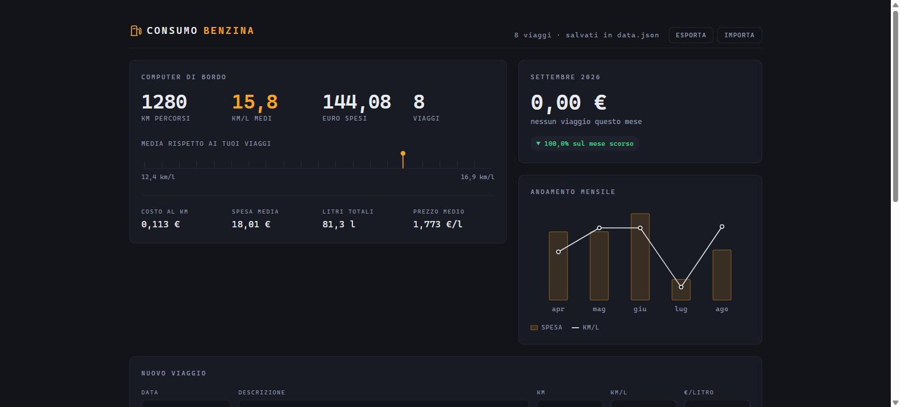

# ⛽ Consumo Benzina

[](https://github.com/iAlias/ConsumoBenzina/actions/workflows/deploy-pages.yml)
[](LICENSE)
[](package.json)

Applicazione web per monitorare i consumi e le spese di carburante dell'auto.
Inserisci i chilometri percorsi, il consumo in km/l e il prezzo al litro: il
resto — litri, spesa, statistiche, andamento mensile — lo calcola l'app.

Nessun database, nessun account, nessuna configurazione: i dati stanno in un
unico file JSON che puoi leggere, copiare e modificare a mano.

**Demo:** <https://ialias.github.io/ConsumoBenzina/> — dati salvati nel tuo
browser, nulla lascia il tuo dispositivo.



## Indice

- [Caratteristiche](#caratteristiche)
- [Tre modi di salvare i dati](#tre-modi-di-salvare-i-dati)
- [Versione locale](#versione-locale)
- [Versione per l'hosting, con archivio sul server](#versione-per-lhosting-con-archivio-sul-server)
- [Versione per l'hosting, senza PHP](#versione-per-lhosting-senza-php)
- [Esporta e importa](#esporta-e-importa)
- [Come funziona](#come-funziona)
- [Inserire più in fretta](#inserire-più-in-fretta)
- [Il file dei dati](#il-file-dei-dati)
- [Test](#test)
- [Struttura del progetto](#struttura-del-progetto)
- [Licenza](#licenza)

## Caratteristiche

- **Statistiche a colpo d'occhio** — km totali, media km/l ponderata sui
  chilometri, spesa totale, costo al km, prezzo medio del carburante.
- **Confronto con il mese scorso** — spesa del mese corrente e variazione
  percentuale rispetto al precedente.
- **Grafico dell'andamento mensile** — spesa e consumo medio, ultimi 12 mesi,
  disegnato in SVG puro: nessuna libreria di grafici.
- **Filtro per periodo** — tutti i viaggi, un anno o un singolo mese.
- **Inserimento veloce** — km/l e prezzo al litro proposti automaticamente
  dall'ultimo viaggio; un pulsante duplica un tragitto abituale con la data di
  oggi.
- **Esporta / Importa** — copie di sicurezza e migrazione dell'archivio tra le
  varianti, stesso formato JSON ovunque.
- **Funziona ovunque** — un server Node in locale, un hosting con PHP, un
  hosting puramente statico (GitHub Pages incluso): stesso codice, stesse
  formule, un solo modulo di calcolo condiviso e testato.

## Tre modi di salvare i dati

Non c'è database: l'archivio è sempre un file JSON. Esistono tre varianti, che
condividono tutto il codice tranne il punto in cui i dati vengono scritti.

| Variante | Dove stanno i dati | Come si prepara |
|---|---|---|
| **Locale** | `data.json` sul tuo PC | `npm start` |
| **Sul sito, con PHP** | `data.json` sul server, condiviso tra tutti i dispositivi | `npm run build` |
| **Sul sito, senza PHP** | nel browser di chi apre la pagina | `npm run build locale` |

## Versione locale

```
npm install     # solo la prima volta
npm start
```

Poi apri <http://localhost:3000>. Per fermare il server, `Ctrl+C` nel terminale.

I dati finiscono in `data.json`: un unico file che puoi copiare, leggere e
modificare a mano.

## Versione per l'hosting, con archivio sul server

```
npm run build
```

Genera `dist/`. **Carica il contenuto di `dist/`** (non la cartella stessa)
nello spazio pubblico del tuo hosting, di solito `public_html` o `www`.

Serve **PHP** sul server — praticamente tutti gli hosting condivisi ce l'hanno.
Non serve Node.

Subito dopo il caricamento, apri nel browser:

```
https://iltuosito.it/percorso/api.php?diagnostica=1
```

Risponde in una riga se il server può salvare i dati. Se dice che non può
scrivere, dal pannello dell'hosting dai il permesso di scrittura alla cartella
(chmod 755).

Attenzione a `.htaccess`: è un file nascosto e molti programmi FTP non lo
mostrano finché non attivi la visualizzazione dei file nascosti. Serve a
impedire che qualcuno scarichi `data.json` digitandone l'indirizzo.

I dati stanno in `data.json` sul server: **lo stesso archivio da PC e da
telefono**. `data.json` non è nella cartella `dist/` — lo crea PHP al primo
salvataggio.

**La pagina è pubblica**: chiunque conosca l'indirizzo può vedere e modificare i
viaggi. Non è un problema di riservatezza (sono consumi di benzina), ma di
vandalismo. Se vuoi, si aggiunge una password.

## Versione per l'hosting, senza PHP

```
npm run build locale
```

Stessa cosa, ma senza `api.php`: i dati vengono salvati **nel browser di chi
apre la pagina**. Dal telefono vedresti un archivio diverso da quello del PC, e
cancellare i dati di navigazione cancella i viaggi. Da usare solo se l'hosting
non esegue PHP.

È la variante pubblicata automaticamente su GitHub Pages, vedi il workflow in
`.github/workflows/deploy-pages.yml`.

## Esporta e importa

I pulsanti in alto a destra funzionano in tutte le versioni. **Esporta** scarica
un file JSON identico a `data.json`; **Importa** lo ricarica, dopo aver detto
quanti viaggi arrivano e quanti se ne perdono.

Servono per le copie di sicurezza e per spostare l'archivio da una versione
all'altra: il formato è lo stesso ovunque.

## Come funziona

Per ogni viaggio l'app calcola:

```
litri = km / (km/l)
spesa = litri × prezzo al litro
```

Vengono salvati solo i dati che inserisci tu. Litri e spesa sono sempre
ricalcolati, quindi correggere un viaggio aggiorna tutto senza lasciare valori
vecchi in giro.

La media km/l mostrata in alto è ponderata sui chilometri: un viaggio da 500 km
pesa più di uno da 20 km.

## Inserire più in fretta

Km/l e prezzo al litro arrivano già compilati con quelli del tuo viaggio più
recente, così per registrarne uno nuovo spesso basta scrivere i chilometri. I
campi proposti hanno il bordo tratteggiato: sono da confermare, e appena ci
scrivi dentro tornano normali.

Per un tragitto che ripeti spesso, il pulsante **duplica** sulla riga riapre il
form con gli stessi valori e la data di oggi.

## Il file dei dati

Stesso formato in tutte le varianti:

```json
{
  "versione": 1,
  "viaggi": [
    {
      "id": "k3f9a2",
      "data": "2026-08-17",
      "descrizione": "Roma - Napoli",
      "km": 225,
      "kmPerLitro": 16.4,
      "prezzoLitro": 1.789
    }
  ]
}
```

Nella versione locale, se `data.json` risulta illeggibile il server si ferma
all'avvio con un messaggio e **non lo sovrascrive**, così i dati restano
recuperabili.

## Test

```
npm test
```

34 test (`node --test`, nessuna dipendenza aggiuntiva) su formule, statistiche
e validazione: `public/calcoli.js` e `public/dominio.js`.

## Struttura del progetto

```
server.js          API REST e file statici (versione locale)
build.js           prepara dist/ per l'hosting
lib/archivio.js    lettura e scrittura di data.json
php/
  api.php          archivio sul server: legge e scrive data.json
  .htaccess        impedisce di scaricare data.json direttamente
public/
  calcoli.js       formule e statistiche — condiviso
  dominio.js       validazione e composizione della risposta — condiviso
  dati.js          indica dove salvare (riscritto da build.js in dist/)
  dati-rete.js     salvataggio tramite il server Node
  dati-php.js      salvataggio tramite api.php
  dati-locale.js   salvataggio in localStorage
  app.js           interfaccia
  index.html, stile.css
test/              test di calcoli.js e dominio.js
```

`api.php` non calcola niente: salva e rilegge soltanto. Litri, spese e
statistiche restano in `calcoli.js`, che gira nella pagina in tutte e tre le
versioni.

## Licenza

Distribuito con licenza [MIT](LICENSE).
